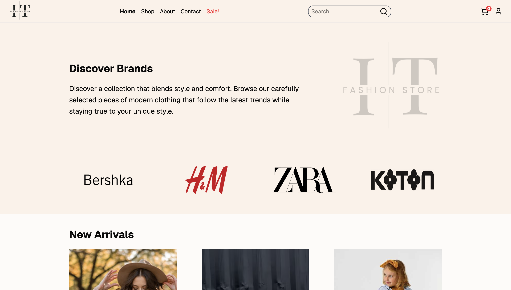

# Fashion E-Commerce Project

This is a responsive web application built with React that allows user to register and log in, browse products, manage their shopping cart, and make a purchases.

## Screenshot



## Features

- Product catalog
- Product details
- Filter products by category
- Manage a shopping cart
- Register and log in
- Responsive UI

## Tech Stack

- React
- JavaScript
- HTML
- Tailwind CSS
- React Router
- Context API
- REST API
- Vite

## Installation

1. Clone the repository and install the dependencies:

```bash
git clone https://github.com/PerosevicAleksandar/react-e-commerce.git
cd react-e-commerce
npm install
```

2. Create a .env file and add your API key:

```env
VITE_API_KEY=your_api_key
```

3. Then start the development server:

```bash
npm run dev
```

## Live Demo

[View Live Demo](https://fashion-store-react.netlify.app)
